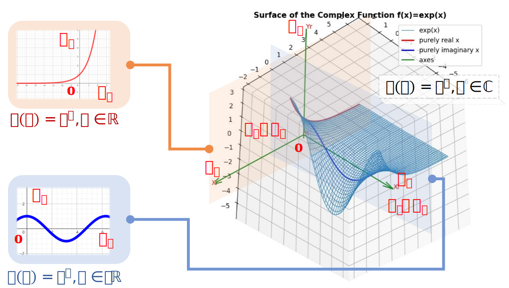
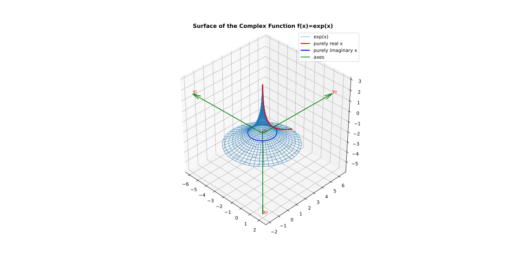

# complex-function-visualizer
🔬可视化绘制给定的复变函数 | visualization of the given complex function

### 安装Python依赖包
```
pip3 install -r requirements.txt
```

### 运行主程序
```
python3 main.py <函数f(x)表达式> <x实部定义域开始值> <x实部定义域结束值> <x虚部定义域开始值> <x虚部定义域结束值>
```
**📘 示例**  
绘制函数```f(x)=exp(x)```，其中```x=a+bi, a∈[-2,2], b∈[-2,2]```。
```
python3 main.py "exp(x)" -2 2 -2 2
```

## 效果图
函数```f(x)=exp(x)```，其中```x=a+bi, a∈[-4,1], b∈[0,6.28]```。  
经过视角的调整，图片视角下的```Yi```轴坍缩为一个点，此时可以将坐标系看作由```Xr-Xi-Yr```组成的**三维坐标系**:

**四条绿线**为坐标系```Xr-Xi-Yr-Yi```四个轴的正方向。```Xr```表示函数自变量的实部，```Xi```为自变量的虚部；```Yr```表示因变量的实部，```Yi```为因变量的虚部。**红线**展示了```x```为纯实数时```f(x)```的图像；**蓝线**展示了```x```为纯虚数时```f(x)```的图像。  

让我们换一个视角，此时图片视角下的```Xi```轴坍缩为一个点，可以将坐标系看作由```Xr-Yr-Yi```组成的**三维坐标系**，函数```f(x)=exp(x)```的图形就像一顶立体的草帽。

